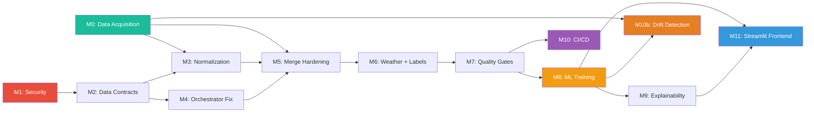

# Flight Pipeline — Engineering Task Backlog

> 40 tasks across 12 milestones. Each task is scoped to ≤3 files, independently testable, and includes pass/fail acceptance criteria.

## Dependency Graph



> **CRITICAL**: M0 (Data Acquisition) is the highest priority. The current ADS-B data covers Dec 2025 while schedules cover Jan–Nov 2025, resulting in **0 merged flights**. The entire ML pipeline is blocked until overlapping data is acquired.

## Milestone Index

| Milestone | File | Tasks | Status |
|-----------|------|-------|--------|
| M0: Data Acquisition | [M00_data_acquisition.md](M00_data_acquisition.md) | T0A–T0D | `[~]` |
| M1: Security & Config | [M01_security.md](M01_security.md) | T1–T2 | `[x]` |
| M2: Data Contracts | [M02_data_contracts.md](M02_data_contracts.md) | T3–T4 | `[x]` |
| M3: Normalization | [M03_normalization.md](M03_normalization.md) | T5–T7 | `[x]` |
| M4: Orchestrator | [M04_orchestrator.md](M04_orchestrator.md) | T8–T9 | `[x]` |
| M5: Merge Hardening | [M05_merge_hardening.md](M05_merge_hardening.md) | T10–T11 | `[x]` |
| M6: Weather & Labels | [M06_weather_labels.md](M06_weather_labels.md) | T12–T14 | `[x]` |
| M7: Quality Gates | [M07_quality_gates.md](M07_quality_gates.md) | T15–T16 | `[x]` |
| M8: ML Training | [M08_ml_training.md](M08_ml_training.md) | T17–T20 | `[~]` |
| M9: Explainability | [M09_explainability.md](M09_explainability.md) | T21–T22 | `[~]` |
| M10: CI/CD & Testing | [M10_cicd_testing.md](M10_cicd_testing.md) | T23–T29 | `[x]` |
| M10b: Drift Detection | [M10b_drift_detection.md](M10b_drift_detection.md) | T30–T31 | `[~]` |
| M11: Streamlit Frontend | [M11_streamlit_frontend.md](M11_streamlit_frontend.md) | FE1–FE8 | `[~]` |

## Summary Table

| # | Task | Milestone | Files Touched | Depends On |
|---|------|-----------|---------------|------------|
| 0A | Build ADS-B backfill CLI | M0 | 2 | — |
| 0B | Fetch overlapping ADS-B data | M0 | outputs only | T0A |
| 0C | Rebuild trajectories from multi-month data | M0 | 2 | T0B |
| 0D | Acquire real METAR weather data | M0 | 2 (1 new) | — |
| 1 | Remove credentials & fix .gitignore | M1 | 3 | — |
| 2 | Fix broken main.py imports | M1 | 1 | — |
| 3 | Define schema contracts | M2 | 1 (new) | — |
| 4 | Wire DataValidator into pipeline | M2 | 3 | T2, T3 |
| 5 | Wire normalizer into BTS combiner | M3 | 2 | T3 |
| 6 | Wire normalizer into Euro combiner | M3 | 2 | T3 |
| 7 | Expand IATA-to-ICAO lookup | M3 | 1 | — |
| 8 | Add --stage CLI to main.py | M4 | 1 | T2 |
| 9 | Add resumable stage support | M4 | 1 | T8 |
| 10 | Per-region merge tolerance | M5 | 2 | T5, T6 |
| 11 | Merge tie-breaking & diagnostics | M5 | 1 | T10 |
| 12 | Handle NaT in label generation | M6 | 1 | — |
| 13 | Target leakage guard | M6 | 1 | T12 |
| 14 | Class distribution & weather diagnostics | M6 | 2 | T12 |
| 15 | Create quality_gates.py | M7 | 1 (new) | T3 |
| 16 | Enforce column order in final export | M7 | 2 | T3, T15 |
| 17 | Model training scaffold + data prep | M8 | 2 | T15, T16 |
| 18 | Train LR + Random Forest | M8 | 1 | T17 |
| 19 | Train XGBoost + LightGBM with Optuna | M8 | 1 | T17 |
| 20 | Model comparison report & visuals | M8 | 2 | T18, T19 |
| 21 | SHAP explanations | M9 | 1 | T20 |
| 22 | Feature selection notebook | M9 | 1 (new) | T20, T21 |
| 23 | pytest infrastructure | M10 | 3 (new) | — |
| 24 | Tests: DataValidator | M10 | 1 (new) | T23 |
| 25 | Tests: ScheduleNormalizer | M10 | 1 (new) | T23 |
| 26 | Tests: LabelGenerator | M10 | 1 (new) | T23 |
| 27 | Tests: QualityGateRunner | M10 | 1 (new) | T23, T15 |
| 28 | GitHub Actions CI | M10 | 1 (new) | T23-T27 |
| 29 | Pin requirements.txt | M10 | 1 | — |
| 30 | Drift detector (real data) | M10b | 1 (new) | T0B, T17 |
| 31 | Wire drift into orchestrator | M10b | 2 | T30 |
| FE1 | Multi-page Streamlit scaffold | M11 | 3 | T20 |
| FE2 | Pipeline Overview page | M11 | 1 (new) | FE1 |
| FE3 | Data Explorer page | M11 | 1 (new) | FE1 |
| FE4 | Trajectory Map page | M11 | 1 (new) | FE1 |
| FE5 | Feature Analysis page | M11 | 1 (new) | FE1, T21 |
| FE6 | Model Performance page | M11 | 1 (new) | FE1, T20 |
| FE7 | Predictions Explorer page | M11 | 1 (new) | FE1, T21 |
| FE8 | Data Quality Dashboard page | M11 | 1 (new) | FE1, T30 |

## Recommended Execution Timeline

```
Week 1:  T0A + T0D + T1 + T2 + T23 + T29    (data acquisition starts, security, test infra)
         ↓ T0A done → kick off T0B (runs for days in background)
Week 2:  T3 + T7 + T12 (while T0B runs)       (schemas, airport codes, NaT handling)
Week 3:  T4 + T5 + T6 + T8                     (validation wiring, normalization, CLI)
         ↓ T0B done → T0C
Week 4:  T9 + T10 + T11 + T13 + T14            (orchestrator, merge, leakage guard)
Week 5:  T15 + T16 + T24 + T25 + T26           (quality gates, column order, unit tests)
Week 6:  T17 + T18 + T27                        (ML scaffold, baselines, quality gate tests)
Week 7:  T19 + T20 + T28                        (boosted models, comparison, CI)
Week 8:  T21 + T22 + T30 + T31                  (SHAP, feature notebook, drift)
Week 9:  FE1 + FE2 + FE3                        (Streamlit scaffold, overview, explorer)
Week 10: FE4 + FE5 + FE6 + FE7 + FE8            (remaining frontend pages)
```
