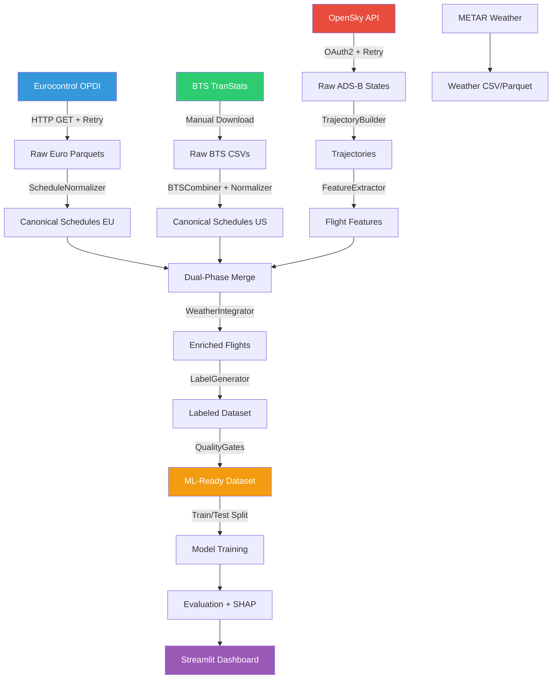

# Flight Disruption Prediction Pipeline — Full Implementation Plan

## Current State Audit

The codebase is a Python-based data pipeline for predicting flight disruptions. It ingests ADS-B surveillance data from OpenSky, merges it with external schedule datasets (BTS US, Eurocontrol EU), enriches with METAR weather data, and generates multi-class labels (Normal / Late / Cancelled).

### What Exists Today

| Layer | File | Status | Notes |
|-------|------|--------|-------|
| Config | `configs/config.yaml` | ⚠️ Partial | Secrets removed to `.env` but `credentials.json` still exists with plaintext keys |
| Ingestion | `src/opensky_client.py` | ✅ Working | OAuth2 OpenSky client with retry |
| Ingestion | `src/data_ingestion.py` | ✅ Working | EurocontrolDownloader, BTSDownloader, Combiners with manifest |
| Trajectory | `src/trajectory_builder.py` | ✅ Working | Groups pings by icao24 + time gap |
| Features | `src/feature_engineering.py` | ✅ Working | 18 ADS-B behavioral features extracted |
| Normalize | `src/normalization.py` | ⚠️ Stub | BTS/Euro canonical mapping exists but not wired into pipeline |
| Merge | `src/merge.py` | ✅ Working | Dual-phase merge (exact + temporal fallback) with QA |
| Weather | `src/weather.py` | ✅ Working | METAR nearest-airport/timestamp join with severity/confidence |
| Labeling | `src/labeling.py` | ✅ Working | delay_minutes + Cancelled/Late/Normal |
| Validation | `src/data_validator.py` | ⚠️ Partial | Schema validator exists but not integrated at pipeline boundaries |
| Validation | `src/config_validator.py` | ✅ Working | Env var startup check |
| Orchestrator | `main.py` | ⚠️ Broken | References `validate_environment` and `set_seed` without importing them |
| Frontend | `app.py` | ✅ Working | Streamlit trajectory explorer |
| Viz | `src/visualisation.py` | ✅ Working | Folium maps + matplotlib |
| Notebooks | `notebooks/01-05` | ✅ Working | Sequential exploration notebooks |

### Critical Issues Found

1. **`credentials.json`** — Plaintext secrets committed to repo (95 bytes, contains clientId + clientSecret)
2. **`.gitignore` corruption** — Last two lines contain null bytes (`\x00`) from a bad `echo .env >>` on PowerShell
3. **`main.py`** — Calls `validate_environment()` and `set_seed()` without importing them (lines 47, 51)
4. **0% retention** — ADS-B sample data (Dec 2025) doesn't overlap BTS/Euro schedules (Jan-Nov 2025)
5. **No ML model** — Pipeline ends at `ml_dataset.parquet` with no training, evaluation, or prediction code
6. **No tests** — Zero unit tests, zero integration tests

### Data Inventory

| Dataset | Size | Records | Period |
|---------|------|---------|--------|
| `adsb_states.parquet` | 2.6 MB | ~103K pings | ~1 week Dec 2025 |
| `euro_dataset_2025.parquet` | 640 MB | ~11M flights | Jan-Nov 2025 |
| `bts_dataset_2025.parquet` | 365 MB | ~6.7M flights | Jan-Nov 2025 |
| `trajectories.parquet` | 2.8 MB | ~103K points / 1,844 trajectories | Dec 2025 |
| `trajectory_features.parquet` | 139 KB | ~1,844 feature vectors | Dec 2025 |
| `ml_dataset.parquet` | 6.6 KB | ~0 rows (empty due to date mismatch) | — |

---

## Architecture Decisions

### AD-1: File-Based Pipeline (No Database)
**Decision**: Keep Parquet files as the storage layer (no Postgres/SQLite).
**Rationale**: This is a dissertation project, not a production SaaS. Parquet gives columnar compression, schema enforcement, and zero-dependency deployment. Each pipeline stage reads/writes self-contained Parquet files.

### AD-2: Modular Python Packages + CLI Orchestrator
**Decision**: Each pipeline stage is a standalone Python module in `src/`. A unified `main.py` orchestrator calls stages sequentially with `--stage` flags.
**Rationale**: Enables both notebook-driven exploration and headless batch execution. No Airflow/Prefect overhead needed for a single-machine pipeline.

### AD-3: Streamlit for Frontend (No React/Flask)
**Decision**: Use Streamlit for all interactive dashboards and client-facing visuals.
**Rationale**: Free, Python-native, zero JS build tooling. Can embed Folium maps, Plotly charts, and SHAP plots natively.

### AD-4: Scikit-learn + XGBoost for ML (No Deep Learning)
**Decision**: Train Random Forest, Gradient Boosting (XGBoost), and Logistic Regression baselines. Use SHAP for explainability.
**Rationale**: Tabular flight features with ~20 columns. Tree ensembles consistently outperform neural networks on structured data of this scale. SHAP provides client-friendly visual explanations.

### AD-5: UTC-Everywhere Timestamp Policy
**Decision**: All timestamps stored as `datetime64[ns, UTC]` or Unix epoch integers. No local timezone storage.
**Rationale**: Flights cross timezone boundaries. Mixing local times causes silent merge failures and label corruption.

---

## Database Schema (Parquet Contracts)

### Stage 1: Raw ADS-B States
```
Path: data/raw/opensky/year={YYYY}/month={MM}/states_{YYYYMMDD}.parquet
```
| Column | Type | Nullable | Description |
|--------|------|----------|-------------|
| icao24 | string | No | Aircraft transponder hex ID |
| callsign | string | Yes (5%) | Flight callsign |
| timestamp | int64 | No | Unix epoch seconds |
| latitude | float64 | No | WGS84 latitude |
| longitude | float64 | No | WGS84 longitude |
| baro_altitude | float64 | Yes (10%) | Barometric altitude (m) |
| geo_altitude | float64 | Yes (20%) | Geometric altitude (m) |
| velocity | float64 | Yes (5%) | Ground speed (m/s) |
| true_track | float64 | Yes (5%) | Heading (degrees) |
| vertical_rate | float64 | Yes (10%) | Climb/descent rate (m/s) |
| on_ground | bool | No | Aircraft on ground flag |

### Stage 2: Trajectories
```
Path: data/processed/trajectories.parquet
```
| Column | Type | Nullable |
|--------|------|----------|
| trajectory_id | string | No |
| icao24 | string | No |
| callsign | string | Yes |
| timestamp | int64 | No |
| latitude | float64 | No |
| longitude | float64 | No |
| altitude | float64 | Yes |
| velocity | float64 | Yes |
| heading | float64 | Yes |

### Stage 3: Flight Features
```
Path: data/processed/trajectory_features.parquet
```
| Column | Type | Nullable |
|--------|------|----------|
| trajectory_id | string | No |
| icao24 | string | No |
| callsign | string | Yes |
| timestamp | int64 | No |
| flight_duration | float64 | No |
| trajectory_length | float64 | No |
| num_points | int64 | No |
| mean_altitude | float64 | Yes |
| altitude_variance | float64 | Yes |
| mean_speed | float64 | Yes |
| max_speed | float64 | Yes |
| speed_std | float64 | Yes |
| vertical_rate_std | float64 | Yes |
| heading_variability | float64 | Yes |
| takeoff_detected | bool | No |
| landing_detected | bool | No |
| holding_pattern_count | int64 | No |
| altitude_change_count | int64 | No |
| unstable_descent_flag | bool | No |

### Stage 4: Canonical Schedule (Normalized)
```
Path: data/processed/{source}_normalized.parquet
```
| Column | Type | Nullable |
|--------|------|----------|
| flight_key | string | No |
| callsign | string | No |
| scheduled_dep | datetime64[ns, UTC] | No |
| scheduled_arr | datetime64[ns, UTC] | No |
| actual_dep | datetime64[ns, UTC] | Yes (cancelled) |
| actual_arr | datetime64[ns, UTC] | Yes (cancelled) |
| origin | string (ICAO) | No |
| destination | string (ICAO) | No |
| cancelled | int64 | No |
| source_dataset | string | No |

### Stage 5: Final ML Dataset
```
Path: data/processed/ml_dataset.parquet
```
| Column | Type | Nullable | Section |
|--------|------|----------|---------|
| flight_key | string | No | Identifier |
| trajectory_id | string | No | Identifier |
| source_dataset | string | No | Provenance |
| region | string | No | Provenance |
| match_quality | string | No | Provenance |
| scheduled_dep | datetime64[ns, UTC] | No | Schedule |
| scheduled_arr | datetime64[ns, UTC] | No | Schedule |
| flight_duration | float64 | No | ADS-B Feature |
| trajectory_length | float64 | No | ADS-B Feature |
| mean_altitude | float64 | Yes | ADS-B Feature |
| mean_speed | float64 | Yes | ADS-B Feature |
| max_speed | float64 | Yes | ADS-B Feature |
| speed_std | float64 | Yes | ADS-B Feature |
| vertical_rate_std | float64 | Yes | ADS-B Feature |
| heading_variability | float64 | Yes | ADS-B Feature |
| takeoff_detected | bool | No | ADS-B Feature |
| landing_detected | bool | No | ADS-B Feature |
| holding_pattern_count | int64 | No | ADS-B Feature |
| altitude_change_count | int64 | No | ADS-B Feature |
| unstable_descent_flag | bool | No | ADS-B Feature |
| wind_speed | float64 | Yes | Weather |
| visibility | float64 | Yes | Weather |
| temperature | float64 | Yes | Weather |
| precipitation | float64 | Yes | Weather |
| weather_severity | int64 | Yes | Weather |
| weather_confidence | string | Yes | Weather |
| delay_minutes | float64 | Yes | Target |
| label | string | No | Target |
| training_eligible | bool | No | Quality Flag |
| feature_quality_score | float64 | No | Quality Flag |

---

## Dataflow Pipeline



---

## Model Architecture

### Approach: Multi-Class Classification
**Target**: `label` ∈ {Normal, Late, Cancelled}
**Metric**: Weighted F1-Score (handles class imbalance)

### Models to Train
| Model | Library | Why |
|-------|---------|-----|
| Logistic Regression | scikit-learn | Interpretable baseline |
| Random Forest | scikit-learn | Strong tabular baseline, feature importance |
| XGBoost | xgboost | State-of-the-art gradient boosting |
| LightGBM | lightgbm | Fast training, handles nulls natively |

### Training Pipeline
1. **Stratified train/test split** (80/20) preserving label distribution
2. **Imputation**: median for numerics, mode for categoricals
3. **Feature scaling**: StandardScaler for LR only (trees don't need it)
4. **Hyperparameter tuning**: Optuna with 5-fold stratified CV
5. **Evaluation**: Confusion matrix, classification report, ROC-AUC (one-vs-rest)
6. **Explainability**: SHAP TreeExplainer for tree models, SHAP LinearExplainer for LR

### Visuals for Client Report
| Visual | Purpose | Tool |
|--------|---------|------|
| Confusion Matrix Heatmap | Show prediction accuracy per class | seaborn |
| ROC Curves (One-vs-Rest) | Show model discrimination power | matplotlib |
| SHAP Summary Plot | Explain which features matter most | shap |
| SHAP Force Plot | Explain individual prediction | shap |
| Feature Importance Bar Chart | Rank features by impact | matplotlib |
| Learning Curves | Show if model needs more data | scikit-learn |
| Class Distribution Pie Chart | Show label balance | plotly |
| Precision-Recall Curves | Show performance on minority classes | matplotlib |

---

## Backend (Pipeline Modules)

### Structured Execution Tasks

#### TASK GROUP 1 — Security & Config Hygiene
```
TASK-1.1: Delete credentials.json, add to .gitignore
TASK-1.2: Fix .gitignore null byte corruption (last 2 lines)  
TASK-1.3: Fix main.py broken imports (validate_environment, set_seed)
TASK-1.4: Add credential rotation checklist to docs/SECURITY.md
TASK-1.5: Generate risk report for exposed OpenSky API credentials
```

#### TASK GROUP 2 — Data Contracts & Validation
```
TASK-2.1: Define schema contracts (dict) for all 5 pipeline stages
TASK-2.2: Wire DataValidator into main.py after each stage output
TASK-2.3: Add fail-fast / warn-only mode toggle via config.yaml
TASK-2.4: Generate sample JSON validation report for each stage
TASK-2.5: Create visual: Pipeline boundary validation diagram
```

#### TASK GROUP 3 — Idempotent Ingestion
```
TASK-3.1: Refactor OpenSky client to partition by date into data/raw/opensky/year=YYYY/...
TASK-3.2: Add retry_with_backoff to OpenSky fetch_states (already in data_ingestion.py)
TASK-3.3: Wire ManifestManager into OpenSky client (currently only in downloaders)
TASK-3.4: Add deterministic primary key dedup to trajectory builder (icao24 + timestamp)
TASK-3.5: Create backfill CLI: --backfill-from YYYY-MM-DD --backfill-to YYYY-MM-DD
TASK-3.6: Create visual: Ingestion checkpoint timeline diagram
```

#### TASK GROUP 4 — Source Adapters & Normalization
```
TASK-4.1: Wire ScheduleNormalizer.normalize_bts() into BTSCombiner output
TASK-4.2: Wire ScheduleNormalizer.normalize_eurocontrol() into EuroCombiner output
TASK-4.3: Add IATA/ICAO reconciliation lookup table (expand beyond 30 US airports)
TASK-4.4: Add unit tests for callsign normalization edge cases
TASK-4.5: Create visual: BTS vs Eurocontrol schema mapping diagram
```

#### TASK GROUP 5 — Merge Engine Hardening
```
TASK-5.1: Add configurable tolerance_hours per region (EU=2h, US=3h) to config.yaml
TASK-5.2: Add deterministic tie-breaking (prefer Phase A over Phase B matches)
TASK-5.3: Generate merge quality JSON report with retention %, precision samples
TASK-5.4: Add one-to-many conflict diagnostic logging
TASK-5.5: Create visual: Merge funnel diagram (input → Phase A → Phase B → output)
```

#### TASK GROUP 6 — Weather + Labeling Hardening
```
TASK-6.1: Add explicit NaT/missing time handling to delay_minutes (return NaN, not crash)
TASK-6.2: Add target leakage guard: ensure actual_dep/arr are NOT used as features
TASK-6.3: Emit class distribution diagnostics as JSON after labeling
TASK-6.4: Add weather null analysis report (% flights without weather match)
TASK-6.5: Create visual: Weather severity distribution histogram
TASK-6.6: Create visual: Label class distribution bar chart
```

#### TASK GROUP 7 — Final Dataset & Quality Gates
```
TASK-7.1: Create src/quality_gates.py with configurable thresholds
TASK-7.2: Add training_eligible flag (True if feature_quality_score > threshold)
TASK-7.3: Add feature_quality_score computation (1.0 - null_fraction across feature cols)
TASK-7.4: Enforce strict column order in final Parquet exporter
TASK-7.5: Add label balance floor check (min 5% per class, else warn)
TASK-7.6: Create visual: Dataset quality dashboard (missingness heatmap + outlier counts)
```

#### TASK GROUP 8 — ML Training Pipeline
```
TASK-8.1: Create src/model_training.py with train/evaluate/save functions
TASK-8.2: Implement stratified train/test split with seed
TASK-8.3: Train Logistic Regression baseline
TASK-8.4: Train Random Forest with Optuna hyperparameter tuning
TASK-8.5: Train XGBoost with Optuna
TASK-8.6: Train LightGBM with Optuna
TASK-8.7: Generate classification reports + confusion matrices for all models
TASK-8.8: Create visual: Model comparison bar chart (F1, Precision, Recall per model)
```

#### TASK GROUP 9 — Explainability & Feature Selection
```
TASK-9.1: Create notebooks/06_feature_selection.ipynb
TASK-9.2: Generate missingness heatmap across all features
TASK-9.3: Generate Pearson + Spearman correlation matrix
TASK-9.4: Compute mutual information ranking vs label
TASK-9.5: Compute permutation importance from best baseline model
TASK-9.6: Generate SHAP summary plot for top features
TASK-9.7: Generate SHAP force plot for sample predictions
TASK-9.8: Create leakage risk checklist per feature
TASK-9.9: Create visual: Feature importance waterfall chart
```

#### TASK GROUP 10 — Stability & Drift Detection
```
TASK-10.1: Create src/drift_detector.py
TASK-10.2: Compute month-over-month PSI for each feature
TASK-10.3: Compute KS test drift scores
TASK-10.4: Generate per-feature stability rank
TASK-10.5: Flag features that are high-importance but unstable
TASK-10.6: Create visual: Feature drift heatmap (feature × month)
```

#### TASK GROUP 11 — Orchestrator Upgrade
```
TASK-11.1: Refactor main.py with --stage flag (ingest|features|merge|weather|label|validate|train|all)
TASK-11.2: Add run metadata logging (start/end time, row counts, stage status) to logs/
TASK-11.3: Add resumable stage support (skip stages that already have output files)
TASK-11.4: Fix existing broken imports in main.py
TASK-11.5: Create visual: Pipeline stage execution flow diagram
```

#### TASK GROUP 12 — CI/CD & Monitoring
```
TASK-12.1: Create .github/workflows/ci.yml (lint + type-check + unit tests)
TASK-12.2: Add pytest.ini and tests/ directory structure
TASK-12.3: Create tests/test_data_validator.py
TASK-12.4: Create tests/test_normalization.py
TASK-12.5: Create tests/test_labeling.py
TASK-12.6: Add daily pipeline KPI summary generator (JSON + console)
TASK-12.7: Add requirements.txt pinning (current versions are unpinned)
TASK-12.8: Create visual: CI/CD pipeline diagram
```

---

## Frontend (Streamlit Dashboard)

### Structured Execution Tasks

```
TASK-FE.1: Expand app.py into multi-page Streamlit app (pages/ directory)
TASK-FE.2: Page 1 — Pipeline Overview (stage status, row counts, last run time)
TASK-FE.3: Page 2 — Data Explorer (raw ADS-B, schedules, merged dataset samples)
TASK-FE.4: Page 3 — Trajectory Map (existing Folium map, add altitude profile)
TASK-FE.5: Page 4 — Feature Analysis (correlation matrix, importance chart, SHAP)
TASK-FE.6: Page 5 — Model Performance (confusion matrix, ROC, comparison table)
TASK-FE.7: Page 6 — Predictions Explorer (input flight → predicted label + SHAP force plot)
TASK-FE.8: Page 7 — Data Quality Dashboard (missingness heatmap, drift alerts)
```

### Visuals Inventory for Client Report

| # | Visual | Pipeline Stage | Tool | Page |
|---|--------|---------------|------|------|
| 1 | Pipeline Architecture Diagram | Overview | mermaid/draw.io | Report |
| 2 | Data Source Volume Bar Chart | Ingestion | plotly | Page 1 |
| 3 | Ingestion Timeline (checkpoint viz) | Ingestion | plotly | Page 1 |
| 4 | Flight Trajectory Map | Trajectory | folium | Page 3 |
| 5 | Altitude Profile Line Chart | Trajectory | matplotlib | Page 3 |
| 6 | BTS/Euro Schema Mapping Sankey | Normalization | plotly | Report |
| 7 | Merge Funnel Diagram | Merge | plotly | Page 1 |
| 8 | Match Quality Distribution | Merge | seaborn | Page 2 |
| 9 | Weather Severity Histogram | Weather | seaborn | Page 2 |
| 10 | Weather Coverage Map | Weather | folium | Page 3 |
| 11 | Label Distribution Pie Chart | Labeling | plotly | Page 5 |
| 12 | Delay Minutes Histogram | Labeling | seaborn | Page 5 |
| 13 | Missingness Heatmap | Quality Gates | seaborn | Page 7 |
| 14 | Correlation Matrix | Feature Selection | seaborn | Page 4 |
| 15 | Mutual Information Ranking | Feature Selection | matplotlib | Page 4 |
| 16 | Feature Importance Bar Chart | Model | matplotlib | Page 4 |
| 17 | SHAP Summary Plot | Model | shap | Page 4 |
| 18 | SHAP Force Plot | Model | shap | Page 6 |
| 19 | Confusion Matrix Heatmap | Model | seaborn | Page 5 |
| 20 | ROC Curves (OvR) | Model | matplotlib | Page 5 |
| 21 | Precision-Recall Curves | Model | matplotlib | Page 5 |
| 22 | Model Comparison Table | Model | streamlit | Page 5 |
| 23 | Learning Curves | Model | scikit-learn | Page 5 |
| 24 | Feature Drift Heatmap | Drift | seaborn | Page 7 |
| 25 | PSI Trend Line Chart | Drift | plotly | Page 7 |

---

## API Contracts

### Internal Python API (Module Interfaces)

#### `src/config_validator.py`
```python
validate_environment(env_path: Path = None) -> None  # sys.exit(1) if missing
```

#### `src/data_validator.py`
```python
DataValidator(mode='fail_fast'|'warn_only', log_dir='logs/')
  .validate(df: DataFrame, schema: dict, dataset_name: str) -> bool
```

#### `src/data_ingestion.py`
```python
ManifestManager(manifest_path: str)
  .log_download(source, year, month, status, row_count, file_path) -> None

EurocontrolDownloader(manifest_mgr)
  .download_month(year, month, base_output_dir) -> Optional[Path]

BTSDownloader(manifest_mgr)
  .download_month(year, month, base_output_dir) -> Optional[Path]

BTSCombiner()
  .combine_csvs(input_dir, output_file) -> Optional[Path]

EuroCombiner()
  .combine_parquets(input_dir, output_file) -> Optional[Path]
```

#### `src/normalization.py`
```python
ScheduleNormalizer
  .canonical_schema() -> dict
  .normalize_bts(df) -> DataFrame       # BTS → canonical
  .normalize_eurocontrol(df) -> DataFrame # Euro → canonical
```

#### `src/trajectory_builder.py`
```python
TrajectoryBuilder(max_gap_minutes=15)
  .build_flight_segments(df) -> DataFrame
  .save_trajectories(df, output_path) -> None
```

#### `src/feature_engineering.py`
```python
FeatureExtractor()
  .extract_features(df) -> DataFrame
  .save_features(df, output_path) -> None
```

#### `src/merge.py`
```python
DataMerger(tolerance_hours=2)
  .merge_datasets(adsb_df, schedule_df) -> DataFrame

MergeQA(log_dir='logs/merge_qa')
  .generate_report(adsb_start_len, merged_df, phase_a_len, phase_b_len, duplicates_dropped) -> dict
```

#### `src/weather.py`
```python
WeatherIntegrator(tolerance_hours=2)
  .add_weather_features(df_flights, df_weather, flight_time_col, airport_col) -> DataFrame
```

#### `src/labeling.py`
```python
LabelGenerator(delay_threshold_minutes=15)
  .generate_labels(df) -> DataFrame
  .standardize_dataset(df) -> DataFrame
```

#### `src/model_training.py` [NEW]
```python
ModelTrainer(config: dict)
  .prepare_data(df) -> Tuple[X_train, X_test, y_train, y_test]
  .train_all() -> Dict[str, Pipeline]
  .evaluate(model, X_test, y_test) -> dict
  .explain(model, X_test) -> shap.Explanation
  .save_model(model, path) -> None
```

#### `src/quality_gates.py` [NEW]
```python
QualityGateRunner(config: dict, mode='fail_fast'|'warn_only')
  .check_missingness(df) -> bool
  .check_outliers(df) -> bool
  .check_duplicates(df) -> bool
  .check_label_balance(df) -> bool
  .check_source_coverage(df) -> bool
  .run_all(df) -> dict  # Returns gate report
```

#### `src/drift_detector.py` [NEW]
```python
DriftDetector()
  .compute_psi(reference, current, bins=10) -> float
  .compute_ks(reference, current) -> float
  .monthly_drift_report(df, date_col, feature_cols) -> DataFrame
```

### CLI Contract (main.py)
```bash
# Run full pipeline
python main.py --stage all

# Run individual stages  
python main.py --stage ingest
python main.py --stage features
python main.py --stage merge
python main.py --stage weather
python main.py --stage label
python main.py --stage validate
python main.py --stage train

# Data ingestion CLI
python src/data_ingestion.py --source euro --year 2025 --month 1
python src/data_ingestion.py --source combine_bts --input_dir data/raw/bts
python src/data_ingestion.py --source combine_euro --input_dir data/raw/eurocontrol
```

---

## Execution Priority & Dependencies

```mermaid
gantt
    title Execution Order
    dateFormat X
    axisFormat %s

    section M1-Security
    TASK-1.1 to 1.5 (Security fixes)    :t1, 0, 1

    section M2-Contracts
    TASK-2.1 to 2.5 (Data contracts)    :t2, 1, 2

    section M3-Ingestion
    TASK-3.1 to 3.6 (Idempotent ingest) :t3, 2, 3
    TASK-4.1 to 4.5 (Normalization)     :t4, 2, 3

    section M4-Merge
    TASK-5.1 to 5.5 (Merge hardening)   :t5, 3, 4

    section M5-Weather+Label
    TASK-6.1 to 6.6 (Weather + Labels)  :t6, 4, 5

    section M6-Dataset
    TASK-7.1 to 7.6 (Quality gates)     :t7, 5, 6

    section M7-ML
    TASK-8.1 to 8.8 (Model training)    :t8, 6, 7
    TASK-9.1 to 9.9 (Feature selection) :t9, 7, 8

    section M8-Drift
    TASK-10.1 to 10.6 (Drift detection) :t10, 8, 9

    section M9-Orchestration
    TASK-11.1 to 11.5 (Orchestrator)    :t11, 5, 6

    section M10-Frontend
    TASK-FE.1 to FE.8 (Dashboard)       :tfe, 7, 9

    section M11-CI
    TASK-12.1 to 12.8 (CI/CD)           :t12, 6, 8
```



## User Review Required

> [!IMPORTANT]
> **Data Gap**: The current ADS-B data covers ~1 week of December 2025, while schedules cover Jan–Nov 2025. This means the merge produces **0 matched flights**. To generate a real ML dataset, either:
> (a) Fetch ADS-B data from Jan–Nov 2025 using OpenSky (rate-limited, will take days), or
> (b) Use the Eurocontrol OPDI data as both schedule AND behavioral source (it contains `first_seen`/`last_seen` timestamps).

> [!WARNING]
> **Leaked credentials**: `credentials.json` contains your OpenSky API client ID and secret in plaintext. These should be rotated immediately after being removed from the repo.

## Open Questions

1. **Which ML models** should we prioritize for the client report? All four (LR, RF, XGB, LGBM) or a subset?
2. **Should drift detection** use synthetic monthly splits from Eurocontrol data, or do you plan to collect real month-over-month ADS-B?
3. **Streamlit deployment** — running locally only, or deploy to Streamlit Cloud / Hugging Face Spaces?
